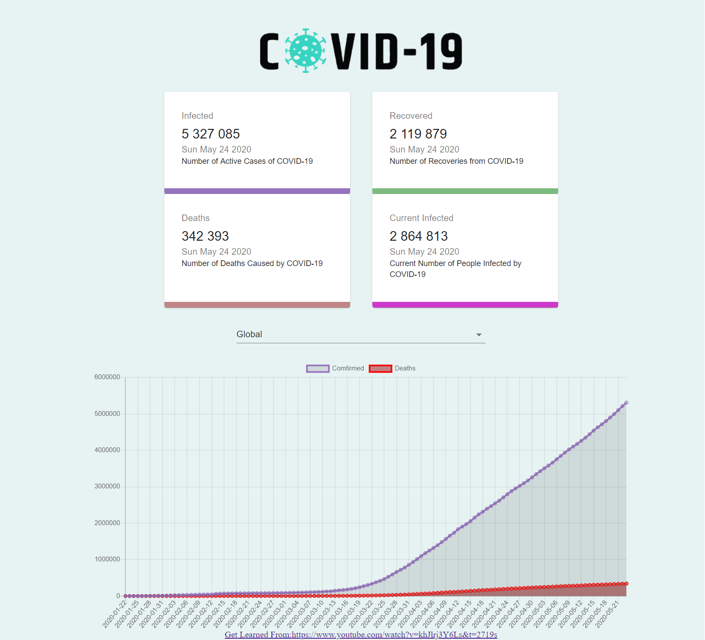
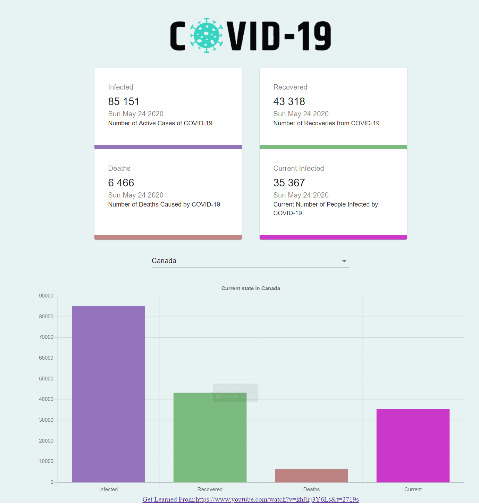

*This is a COVID-19 Tracker Web App created based React, get learnt form :* https://www.youtube.com/watch?v=khJlrj3Y6Ls&t=2719s

#You can view the global covid-19 status in Line-chart format

#Select a country's status in the list to view the data in Bar-chart format

